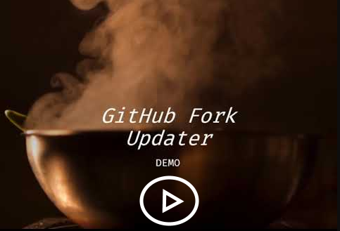

This repository has been created to facilitate updating your forked repositories with review actions. Especially helpful when having a separate organization for all your forked GitHub Actions (as you should for security reasons). Read more on that topic [here](https://devopsjournal.io/blog/2021/02/06/GitHub-Actions-Forking-Repositories).

Process:
* Fork this repository to the organization / account you want to update your forks in.
* Configure it using the steps below.
* On a schedule, the workflow will run checking all the repositories in the organization / account
* If the repository is a fork, it will be checked for incoming updates
* If there are updates, an issue in the `GitHubForkUpdater` repository will be created.
* Validate the incoming changes using the link in the issue
* If you add the label `update-fork` to the issue, your fork will be updated
* And the issue will be closed

# Steps
Watch the demo video here:  

Or follow these steps:
1. Fork this repository to your own organization.
1. Enable issue in the forked repository (issues are disabled on the fork by default, since you'd want any issues to be created on the parent repo, not the forked one).
1. Enable the workflow `check-workflow.yml` and allow the schedule to run (GitHub security feature).
1. Either add a repository secret named `PAT_GITHUB` containing a GitHub Personal Access Token with these scopes: `public_repo, read:org, read:user, repo:status, repo_deployment` (see below on why) or use a GitHub App with `GH_AUTOMATION_ID` and `GH_AUTOMATION_PRIVATE_KEY`. Read more info on the differences [here](https://devopsjournal.io/blog/2022/01/03/GitHub-Tokens).
1. Add configuration for using a GitHub App or a PAT with the Actions variable in your repo called `USE_GITHUB_APP`, value is true or false.
1. Trigger the `check-workflow.yml` workflow manually for the first run or wait for the schedule to run.
1. Check the new issues on the forked repo for instructions on updating your forks.
1. Verify incoming changes and label the issue if you want to update the fork.
1. Use the default GitHub Notification messages to keep all your forks up to date or use the `Send notification` variable to tag a team when a new issue is created. Variables are `SEND_NOTIFICATION` and `NOTIFICATION_TEAM`.
1. Enjoy!

# Schedule runs
The scheduled runs are planned at weekdays, at 7 AM.

# check-workflow.yml
The check-workflow will iterate all repositories in the same organization (or user) and find the ones that are forks of another repository (called parent repository). For the forks it will check if there are updates available in the parent repository and if so, create new issues in this repository (GitHubForkUpdater) with a link to verify those changes. 

## Security
This workflow will run using the default `GITHUB_TOKEN`, which is enough to iterate through your own **public** repositories and check the public parents for incoming changes.

##### Note: This workflow can be triggered manually or will run on a schedule.

# update-workflow.yml
The issues will have links for you to review all incoming changes from the parent repository. Please go through all those changes and review if you want to pull in the changes. Especially for GitHub Actions you use, it is very important to review the changes: otherwise you are updating code from the internet that will run in your own workflows 😱. Read more info [here](https://devopsjournal.io/blog/2021/12/11/GitHub-Actions-Maturity-Levels).

After reviewing the changes in the parent repository, you can decide to pull in those changes into your own fork. Adding the label `update-fork` on the issues will trigger the `update-workflow` to pull in the incoming changes. The issue will be updated when the workflow starts and be closed when the workflow has completed successfully. If there are merge conflicts, the workflow will fail and add a message in the issue.

Note: currently only the `default branch` will be updated, together with all Tags.

## Security 
To be able to push the incoming changes into your fork we need a GitHub Access Token used in this workflow with the name `PAT_GITHUB`. This token needs to have the following scopes: `public_repo*, read:org, read:user, repo:status*, repo_deployment*, workflow`.  
`*` These scopes are set by default when the `workflows` scope is set

There are two ways to create this token:
1. Use a GitHub App and get the token from it (Recommended)
1. Use a Personal Access Token (has to much rights and is a security risk)!

You can read more information about this in this [blogpost](https://devopsjournal.io/blog/2022/01/03/GitHub-Tokens).

